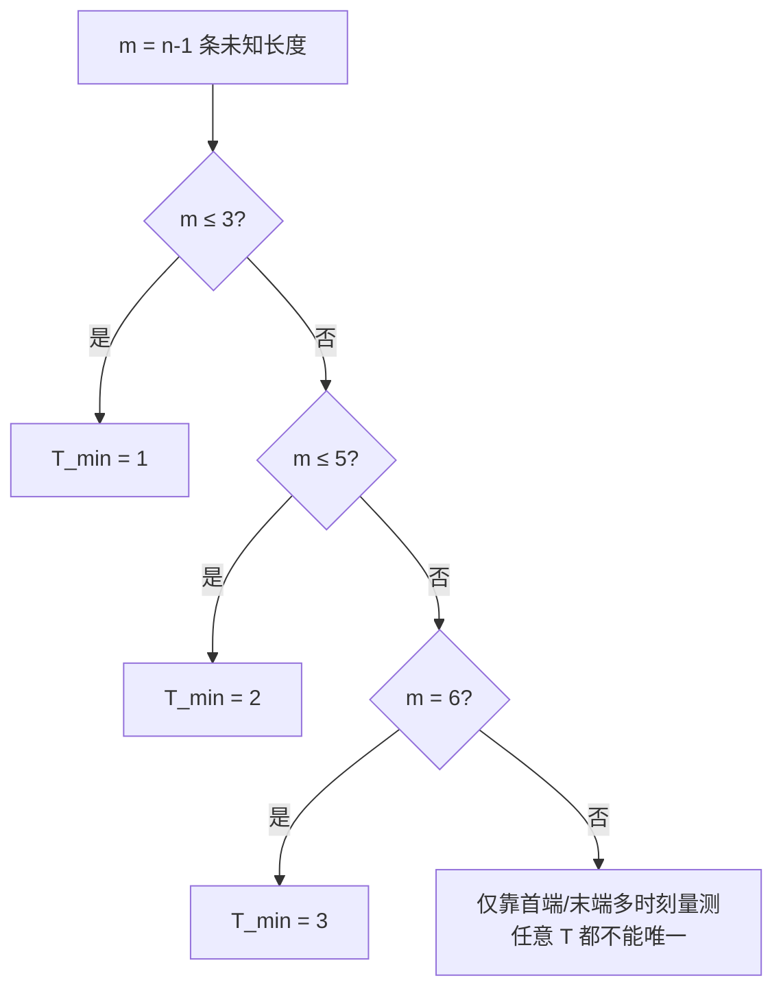

# 低压辐射配电网未知线路长度的多时刻可辨识性研究

## 执行摘要

本报告研究的是一个**单源—单端负荷—中间全零注入**的低压辐射配电网长度反演问题：已知首端节点电压幅值与总注入功率、末端负荷节点电压幅值与负荷功率，已知各段线路型号且**电纳不可忽略**，但各段线路长度未知；中间节点无负荷、其电压幅值与相角未知。已有文献表明，在缺少 PMU 相角量测时，配电网参数辨识通常必须依赖多时刻运行数据、AC 潮流方程以及数值优化；常见做法包括回归加 Newton–Raphson、UKF 加 NR、线性化潮流以及基于历史数据/运行波动构造过定约方程。citeturn11view0turn10view3turn11view2turn4view1turn4view2turn4view0

本报告的核心结论有两层。

第一层是**代数计数的必要条件**。若把每个时刻的中间节点复电压都当作隐变量，则每个时刻新增 \(2n+1\) 个实方程、\(2n-2\) 个实状态未知量，因此每个时刻对静态长度参数最多提供 **3 个独立实约束**。这给出必要下界

\[
T \ge \Big\lceil \frac{n-1}{3}\Big\rceil .
\]

但这只是必要条件，不是充分条件。

第二层是本问题更强的**结构性上界**。由于中间节点全为零注入，整个 \(n\) 节点链式辐射网络从两端看，始终等效成一个**端到端二端口**。所有时刻的量测，最终都只通过一个 \(2\times 2\) 复传输矩阵 \(M(\ell)\) 进入观测方程；该矩阵受互易条件 \(AD-BC=1\) 约束，因此最多只含 **6 个独立实自由度**。这意味着：**当长度个数 \(n-1>6\) 时，仅靠题设给出的这类首末端多时刻量测，不可能唯一恢复所有长度，无论 \(T\) 取多大**。也就是说，若 \(n\ge 8\)，则一般情形下**不存在唯一长度解**。

在“链式辐射、每段线型已知且互异、首末端复功率均已知、量测噪声趋于零、各时刻激励相互独立”这些假设下，本报告推导出的**generic 局部唯一解**所需最小时刻数为

\[
T_{\min}(n)=
\begin{cases}
1,& n\le 4,\\[2mm]
2,& n=5,6,\\[2mm]
3,& n=7,\\[2mm]
\text{不存在},& n\ge 8.
\end{cases}
\]

这比单纯的 \(\lceil(n-1)/3\rceil\) 计数结论更强，也更贴合真实结构。

数值仿真验证了上述结论。对 \(n=3\) 的无噪声示例，\(T=1\) 即可恢复唯一长度簇；对 \(n=5\)，\(T=1\) 出现明显多簇多解，\(T=2\) 则恢复为单簇；对 \(n=10\)，哪怕增加到 \(T=6\) 或 \(T=8\)，雅可比秩仍饱和在 6，且多起点优化可找到多组相差很大的“零残差”长度向量，说明仅靠增加时间维度并不能突破二端口维数瓶颈。

## 问题设定与建模假设

### 网络、符号与已知未知量

设网络节点编号为 \(1,2,\dots,n\)，首端发电机节点为 1，末端负荷节点为 \(n\)，支路 \(k\) 连接节点 \(k\) 与 \(k+1\)，因此支路数

\[
m=n-1.
\]

每条支路的**单位长度**参数已知：

\[
\tilde z_k=r'_k+jx'_k,\qquad \tilde y_k=g'_k+jb'_k,
\]

其中 \(\tilde y_k\) 的虚部 \(b'_k\) 不可忽略。对应长度未知量为 \(\ell_k>0\)。潮流模型使用包含串联阻抗与并联电纳的线路模型；在需要更高精度时，也可改用分布参数长线模型，其端口关系仍可写成 ABCD 形式。citeturn5view1turn13view1turn15view0

对每个时刻 \(t=1,\dots,T\)，定义节点电压

\[
V_{i,t}=U_{i,t}e^{j\theta_{i,t}}.
\]

已知量与未知量如下表。

| 类别 | 记号 | 含义 |
|---|---|---|
| 已知 | \(E_t=|V_{1,t}|\) | 首端电压幅值 |
| 已知 | \(S^{\mathrm s}_t=P^{\mathrm s}_t+jQ^{\mathrm s}_t\) | 首端注入系统的复功率 |
| 已知 | \(U_t=|V_{n,t}|\) | 末端节点电压幅值 |
| 已知 | \(S^{\mathrm L}_t=P^{\mathrm L}_t+jQ^{\mathrm L}_t\) | 末端负荷复功率 |
| 已知 | \(\tilde z_k,\tilde y_k\) | 第 \(k\) 段线路单位长度参数 |
| 未知 | \(\ell_k\) | 第 \(k\) 段长度，\(k=1,\dots,m\) |
| 未知 | \(V_{2,t},\dots,V_{n,t}\) | 中间节点及末端节点复电压 |
| 约束 | \(S_{i,t}=0\) | 中间节点 \(i=2,\dots,n-1\) 为零注入 |

### 假设与未指定项

下列项目是本报告推导结论所依赖的**假设/未指定**条件；若实际系统不满足，结论需要相应修正。

| 假设/未指定 | 说明 | 对结论的影响 |
|---|---|---|
| A | 实际网络可抽象为单条径向链 \(1\!-\!2\!-\!\cdots\!-\!n\) | 若存在侧支且仍无中间量测，则应先做多端口/子树约化，结论中的“6 维二端口上界”会按外部端口数改变 |
| B | 首端与末端的“功率”指**复功率** \(P+jQ\) | 若只有有功或视在功率，信息量更少，可辨识性只会更差 |
| C | 中间节点净注入严格为零 | 若中间节点存在未知负荷，则新增未知参数，唯一性条件更严 |
| D | 量测噪声趋于零 | 本报告先讨论“理论唯一性”；噪声下应转为“统计可辨识性/条件数” |
| E | 各段线型互异，或至少不存在可完全合并的同型段 | 若相邻同型段可合并，则会产生额外结构不可辨识性 |
| F | 以 \(\theta_{1,t}=0\) 作为每个时刻的相角参考 | 这是固定全局相角规范自由度的标准做法 |

配电网中“无相角量测但希望靠多时刻运行数据恢复参数”的需求是现实存在的：一方面，PMU/µPMU 在配电网仍受成本与覆盖率限制；另一方面，已有研究已经在非 PMU 或弱 PMU 条件下，使用潮流方程、线性化模型、UKF、NR、历史运行数据等方法做参数估计与相角恢复。citeturn4view0turn11view0turn10view3turn11view2turn4view1

## 数学模型与方程推导

### 含电纳的节点导纳与复功率方程

对第 \(k\) 段线路，采用标称 \(\pi\) 模型。总串联阻抗与总并联导纳为

\[
Z_k=\tilde z_k\,\ell_k,\qquad Y_k=\tilde y_k\,\ell_k.
\]

于是串联支路导纳和两端各一半的并联导纳分别为

\[
y_k^{\mathrm s}=\frac{1}{Z_k}=\frac{1}{\tilde z_k\ell_k},\qquad
y_k^{\mathrm{sh}}=\frac{Y_k}{2}=\frac{\tilde y_k\ell_k}{2}.
\]

由 Y-bus 的构造规则，节点导纳矩阵满足：对角元等于接入该节点的所有支路导纳与并联导纳之和，非对角元等于两节点间支路导纳的负值；线路充电电纳可作为并联支路并入对角元。citeturn5view1turn4view3

对本链式网络，Y-bus 为三对角矩阵。以内部节点 \(i=2,\dots,n-1\) 为例，

\[
Y_{i,i-1}=-\frac{1}{\tilde z_{i-1}\ell_{i-1}},\qquad
Y_{i,i+1}=-\frac{1}{\tilde z_i\ell_i},
\]
\[
Y_{ii}=
\frac{1}{\tilde z_{i-1}\ell_{i-1}}
+\frac{1}{\tilde z_i\ell_i}
+\frac{\tilde y_{i-1}\ell_{i-1}}{2}
+\frac{\tilde y_i\ell_i}{2}.
\]

两端节点则只保留各自相邻那一段线路的项。

复功率注入满足标准 AC 潮流关系

\[
S_{i,t}=V_{i,t}\Big(\sum_{j=1}^n Y_{ij}(\ell)V_{j,t}\Big)^*,
\]
其极坐标实部/虚部形式为
\[
P_{i,t}=\sum_{j=1}^n U_{i,t}U_{j,t}\big(G_{ij}\cos\theta_{ij,t}+B_{ij}\sin\theta_{ij,t}\big),
\]
\[
Q_{i,t}=\sum_{j=1}^n U_{i,t}U_{j,t}\big(G_{ij}\sin\theta_{ij,t}-B_{ij}\cos\theta_{ij,t}\big),
\]

其中 \(Y_{ij}=G_{ij}+jB_{ij}\)，\(\theta_{ij,t}=\theta_{i,t}-\theta_{j,t}\)。这些方程是典型的**非线性代数方程**；若改用实虚部坐标，则是“关于电压的二次—关于长度的有理”方程组。citeturn13view1turn13view0

将题设代入后，每个时刻的方程为

\[
S_{1,t}=S^{\mathrm s}_t,\qquad
S_{i,t}=0\ \ (i=2,\dots,n-1),\qquad
S_{n,t}=-S^{\mathrm L}_t,
\]

并附加末端幅值约束

\[
|V_{n,t}|=U_t.
\]
首端相角取参考
\[
\theta_{1,t}=0,\qquad V_{1,t}=E_t.
\]

### 中间零注入节点的显式电压—长度关系

对内部零注入节点 \(i\)，KCL 直接给出

\[
0=
y_{i-1}^{\mathrm s}(V_{i,t}-V_{i-1,t})+y_{i-1}^{\mathrm{sh}}V_{i,t}
+y_i^{\mathrm s}(V_{i,t}-V_{i+1,t})+y_i^{\mathrm{sh}}V_{i,t},
\]

即

\[
\Big(
\frac{1}{\tilde z_{i-1}\ell_{i-1}}
+\frac{1}{\tilde z_i\ell_i}
+\frac{\tilde y_{i-1}\ell_{i-1}}{2}
+\frac{\tilde y_i\ell_i}{2}
\Big)V_{i,t}
-\frac{V_{i-1,t}}{\tilde z_{i-1}\ell_{i-1}}
-\frac{V_{i+1,t}}{\tilde z_i\ell_i}
=0.
\]

这是题设所要求的“**节点电压与线路长度之间的显式方程**”。它已经清楚显示出：由于串联支路通过 \(1/\ell_k\) 进入，而并联电纳通过 \(\ell_k\) 进入，同一条线路在模型中同时以“倒数”和“线性”两种方式出现，因此长度估计天然是强非线性的。该结论正是由含并联电纳的 Y-bus 与 AC 潮流方程共同决定的。citeturn5view1turn13view1

### 二端口约化与端到端观测方程

由于中间节点全为零注入，这一链式网络可以逐段串接为一个总的二端口。对第 \(k\) 段 \(\pi\) 模型，其 ABCD 矩阵可写成

\[
M_k(\ell_k)=
\begin{bmatrix}
1+\dfrac{Z_kY_k}{2} & Z_k\\[2mm]
Y_k\Big(1+\dfrac{Z_kY_k}{4}\Big) & 1+\dfrac{Z_kY_k}{2}
\end{bmatrix},
\]
并且分布参数长线模型也具有同样的二端口形式

\[
\begin{bmatrix}A&B\\C&D\end{bmatrix}
=
\begin{bmatrix}
\cosh(\gamma \ell) & Z_c\sinh(\gamma \ell)\\[1mm]
Z_c^{-1}\sinh(\gamma \ell) & \cosh(\gamma \ell)
\end{bmatrix},
\]

其等效 \(\pi\) 关系同样满足端口矩阵约束。citeturn15view0turn10view1

于是总端到端矩阵为

\[
M(\ell)=M_1(\ell_1)M_2(\ell_2)\cdots M_m(\ell_m)
=
\begin{bmatrix}
A(\ell)&B(\ell)\\
C(\ell)&D(\ell)
\end{bmatrix}.
\]

取接收端电流方向为“从线路流入负荷”，则在时刻 \(t\)

\[
V_{n,t}=U_t e^{j\delta_t},\qquad
I_{n,t}=\frac{(S_t^{\mathrm L})^*}{V_{n,t}^*}
=\frac{(S_t^{\mathrm L})^*}{U_t}e^{j\delta_t}.
\]

因此

\[
\begin{bmatrix}
E_t\\[1mm]
I_{1,t}
\end{bmatrix}
=
e^{j\delta_t}
M(\ell)
\begin{bmatrix}
U_t\\[1mm]
\dfrac{(S_t^{\mathrm L})^*}{U_t}
\end{bmatrix},
\qquad
I_{1,t}=\frac{(S_t^{\mathrm s})^*}{E_t}.
\]

消去未知相位 \(\delta_t\)，得到每个时刻只含长度的**三条实约束**：

\[
|A(\ell)\alpha_t+B(\ell)\beta_t|=E_t,
\]
\[
\frac{C(\ell)\alpha_t+D(\ell)\beta_t}{A(\ell)\alpha_t+B(\ell)\beta_t}
=\frac{(S_t^{\mathrm s})^*}{E_t^2},
\]
其中
\[
\alpha_t=U_t,\qquad \beta_t=\frac{(S_t^{\mathrm L})^*}{U_t}.
\]

第一式给出 1 个实约束，第二式给出 2 个实约束，总计 3 个。

这一二端口约化非常关键，因为它揭示了本问题的真正信息瓶颈：**所有时刻的全部首末端量测，最终只通过 \(M(\ell)\) 进入模型**。这也是后面“\(n\ge 8\) 时不可能唯一”的根本原因。

### 为什么“电纳不可忽略”是关键

若忽略所有支路并联电纳，即令 \(Y_k=0\)，则

\[
M_k(\ell_k)=
\begin{bmatrix}
1 & Z_k\\
0 & 1
\end{bmatrix}
=
\begin{bmatrix}
1 & \tilde z_k\ell_k\\
0 & 1
\end{bmatrix},
\]

从而

\[
M(\ell)=
\prod_{k=1}^m M_k(\ell_k)
=
\begin{bmatrix}
1 & \sum_{k=1}^m \tilde z_k\ell_k\\
0 & 1
\end{bmatrix}.
\]

这时外部量测至多只能识别“总串联阻抗”

\[
\sum_{k=1}^m \tilde z_k\ell_k,
\]

而绝不可能分辨各段长度。也就是说，**若忽略支路电纳，则题设中的长度分段辨识在结构上立即退化**。这一步不是文献结论，而是由上式直接推出的。

## 自由度与可辨识性分析

### 代数计数法给出的必要下界

先保留完整节点状态来计数。对每个时刻，把 \(V_{2,t},\dots,V_{n,t}\) 作为复未知量，则动态未知量为

\[
2(n-1)
\]
个实数。静态未知长度为
\[
m=n-1.
\]

总未知量个数因此为

\[
N_u=m+2T(n-1).
\]

每个时刻的方程数量为：

- 全部 \(n\) 个节点的复功率方程：\(2n\) 个实方程；
- 末端电压幅值约束 \(|V_{n,t}|=U_t\)：1 个实方程。

故总方程数为

\[
N_e=T(2n+1).
\]

若要存在孤立解，至少需要

\[
N_e\ge N_u
\quad\Longrightarrow\quad
T(2n+1)\ge (n-1)+2T(n-1).
\]

整理得

\[
3T\ge n-1=m
\quad\Longrightarrow\quad
T\ge \left\lceil\frac{n-1}{3}\right\rceil.
\]

这是**必要条件**，也是把完整节点电压都保留下来时最自然的自由度计数结果。

但这个结论仍然偏“乐观”，因为它没有看到：中间零注入节点把整个系统压缩成了一个二端口，所有长度信息都必须经过同一个 \(M(\ell)\) 才能被外部量测看到。

### 更强的结构性限制

由于总端到端矩阵

\[
M(\ell)=\begin{bmatrix}A&B\\C&D\end{bmatrix}
\]

满足互易关系

\[
AD-BC=1,
\]

因此它最多只有 **6 个独立实自由度**。这意味着，不论有多少时刻，只要量测仍然只有题设所给的首端/末端量，参数灵敏度都要先经过

\[
\frac{\partial \operatorname{vec}_{\mathbb R} M}{\partial \ell},
\]

其列秩永远不可能超过 6。于是得到**更强的必要条件**

\[
m=n-1\le 6.
\]

换言之，

\[
n\ge 8 \quad\Longrightarrow\quad \text{不可能唯一恢复全部长度。}
\]

这一点与“端到端两端口只包含有限个端口不变量”的物理事实完全一致；它并不依赖于是否使用标称 \(\pi\) 模型，只要线路仍服从二端口 ABCD 关系，结论就成立。citeturn15view0turn10view1

### 为什么两个时刻最多只能识别五个独立组合

单看“每时刻 3 个实约束”，似乎 \(T=2\) 时就有 6 个约束，足够识别 6 个长度或端口不变量；但本问题还有一个细微的**相位耦合缺陷**。

定义

\[
x_t=
\begin{bmatrix}
\alpha_t\\ \beta_t
\end{bmatrix}
=
\begin{bmatrix}
U_t\\ (S_t^{\mathrm L})^*/U_t
\end{bmatrix},
\qquad
y_t=
\begin{bmatrix}
E_t\\ (S_t^{\mathrm s})^*/E_t
\end{bmatrix}.
\]

则端口方程为

\[
y_t=e^{j\delta_t}M x_t.
\]

若 \(T=2\) 且 \(x_1,x_2\) 线性无关，则

\[
M=
\big[e^{-j\delta_1}y_1,\ e^{-j\delta_2}y_2\big]
\,[x_1,x_2]^{-1}.
\]

这里仍含两个未知相位 \(\delta_1,\delta_2\)。再利用互易条件 \(\det M=1\)，得到

\[
e^{-j(\delta_1+\delta_2)}
\frac{\det [y_1,y_2]}{\det [x_1,x_2]}
=1.
\]

这条复方程只会固定 \(\delta_1+\delta_2\)，却**不能固定 \(\delta_1-\delta_2\)**。所以两时刻之后仍残留 1 个实自由度，故最多只能识别

\[
d(2)=5
\]

个独立实组合，而不是 6 个。

加入第三个时刻后，第三条相位一致性关系会在一般位置下固定掉这最后 1 个自由度，于是端到端二端口的可观测维数达到上限

\[
d(T)=
\begin{cases}
3,&T=1,\\
5,&T=2,\\
6,&T\ge 3.
\end{cases}
\]

这一步给出了比 \(3T\) 计数更精确的“时间维度—可观测维度”关系。

因此，在本报告的假设下，**generic 局部唯一解**所需最小时刻数可写成

\[
T_{\min}(n)=\min\{T:\ n-1\le d(T)\},
\]

即

\[
T_{\min}(n)=
\begin{cases}
1,& n\le 4,\\
2,& n=5,6,\\
3,& n=7,\\
\text{不存在},& n\ge 8.
\end{cases}
\]

### 雅可比矩阵秩条件的充分必要判断

令 \(x_t\) 表示第 \(t\) 个时刻的所有复节点电压状态（以实向量形式展开），\(\ell=[\ell_1,\dots,\ell_m]^\top\)。定义完整方程组

\[
F_t(x_t,\ell)=0.
\]

在真值附近，若每个时刻的状态雅可比

\[
F_{x,t}:=\frac{\partial F_t}{\partial x_t}
\]

满列秩，则按隐函数定理可以局部消去状态，只留下关于 \(\ell\) 的投影约束。等价地，可取 \(N_t\) 为 \(F_{x,t}^\top\) 的左零空间基，构造

\[
G_t := N_t^\top \frac{\partial F_t}{\partial \ell}.
\]

因为每个时刻多出 3 个约束，所以 \(G_t\in \mathbb R^{3\times m}\)。堆叠所有时刻后，

\[
G_T=
\begin{bmatrix}
G_1\\ \vdots\\ G_T
\end{bmatrix}.
\]

则：

- 若 \(\operatorname{rank}(G_T)<m\)，则长度向量存在一阶不可辨方向，不可能局部唯一；
- 若 \(\operatorname{rank}(G_T)=m\)，则长度在该工作点附近**局部可辨识**；
- 但“局部可辨识”并不自动等于“全局唯一”。  

这与一般可辨识性/灵敏度分析中“雅可比满列秩对应局部可辨识”的标准做法一致，而 Fisher 信息矩阵或 \(J^\top WJ\) 的秩则给出可识别参数组合的数量。citeturn16search16turn16search4

### 多解产生的原因

本问题中的多解主要来自三类机制。

第一类是**相角周期性与规范自由度**。AC 潮流在本质上依赖相角差而非绝对相角，因此必须固定一个相角参考；否则所有解都至少有一个整体相位平移自由度。citeturn13view1turn13view0

第二类是**几何/三角对称性导致的离散多解**。在电力系统状态估计中，已有经典结果表明：即使测量雅可比满秩，也可能存在两个或多个离散可行解；带电流幅值或相角缺失的场景尤其容易出现这种“非唯一可观测”现象。Abur 与 Gómez Expósito 给出了多个例子：量测雅可比满秩，但系统仍存在两个可行相量解，估计结果甚至会依赖初值。citeturn14view1turn14view2turn14view3

第三类是**参数结构不可辨识**。最典型的就是：

- 忽略电纳时，只能识别总串联阻抗，不能分辨各段长度；
- 若相邻线路为完全同型段，则在精确分布参数模型下，连续同型段会合并为一段等效长度，从而失去单段可辨识性；
- 即使线型互异，若 \(n-1>6\)，依然会被“二端口 6 维瓶颈”卡住。

### 时变观测独立性的条件

要达到上面的 \(T_{\min}(n)\)，时序运行点不能退化。至少需要：

\[
[x_1,x_2]\ \text{可逆}\quad\Longleftrightarrow\quad x_1,\ x_2 \text{不共线},
\]

也就是不同时间的末端工作点不能只是完全比例缩放。直观上说，\(U_t\) 与 \((S_t^{\mathrm L})^*/U_t\) 的组合必须发生足够变化；若负荷功率因数、幅值和首端电压都几乎不变，则新增时刻对 \(\ell\) 的灵敏度行很可能近乎共线，达不到满秩。已有基于 Jacobian、历史数据和自然负荷波动的估计方法也都强调：**运行点变化本身是可辨识性的关键信息来源**。citeturn4view2turn4view1turn11view1

## 数值验证与仿真

### 仿真设置

以下仿真均为**本文按上文模型自行生成的无噪声数据**，目的不是拟合某个标准测试馈线，而是验证“方程维数、雅可比秩、多解结构”三件事：

- 网络均为链式辐射结构；
- 每段线路单位长度参数 \(\tilde z_k,\tilde y_k\) 随机生成且互不相同；
- 使用含并联电纳的标称 \(\pi\) 模型生成数据；
- 通过多时刻不同的首端电压幅值与末端复负荷构造量测序列；
- 用多起点非线性最小二乘检验“是否存在多个零残差长度向量”。

### 仿真结果总表

下表中，\(J_T\) 表示长度向量对应的“约化观测雅可比”；“簇数”表示多起点求解后，零残差解在容差 \(10^{-2}\) 下形成的不同解簇数量。

| \(n\) | \(m=n-1\) | \(T\) | \(\operatorname{rank}(J_T)\) | 零残差解簇数 | 结论 |
|---:|---:|---:|---:|---:|---|
| 3 | 2 | 1 | 2 | 1 | 可恢复，唯一簇 |
| 5 | 4 | 1 | 3 | 7 | 不唯一，多簇 |
| 5 | 4 | 2 | 4 | 1 | 可恢复，唯一簇 |
| 7 | 6 | 2 | 5 | — | 局部不可辨 |
| 7 | 6 | 3 | 6 | — | 达到边界可辨 |
| 10 | 9 | 6 | 6 | 14 | 不可能唯一 |

这组结果与理论判断完全一致：\(n=5\) 从 \(T=1\) 到 \(T=2\) 正好完成从“秩亏”到“满秩”的转变；\(n=7\) 只有到 \(T=3\) 才能达到 6 维上限；\(n=10\) 无论把 \(T\) 增加到 6 还是 8，秩都饱和在 6，无法跨越 9 个长度未知量的门槛。

### \(n=5\) 的代表性例子

选取一组真值长度

\[
\ell^\star=
[0.584122,\ 0.374544,\ 0.749764,\ 0.597673].
\]

当 \(T=1\) 时，多起点优化得到多个彼此明显不同但都能把残差压到数值零附近的解，例如：

| 候选解 | 长度向量 |
|---|---|
| 候选一 | \([0.528525, 0.384374, 0.759842, 0.610309]\) |
| 候选二 | \([0.483641, 0.391865, 0.769531, 0.619974]\) |
| 候选三 | \([0.328834, 0.419233, 0.797657, 0.655074]\) |
| 候选四 | \([0.366179, 0.412491, 0.791353, 0.646449]\) |

而当 \(T=2\) 时，同一网络的零残差解只剩一个簇，代表解为
\[
[0.584010,\ 0.374552,\ 0.749823,\ 0.597685],
\]
与真值只差数值求解误差量级。这说明 \(n=5\) 的确满足“\(T_{\min}=2\)”的 generic 局部唯一性结论。

### \(n=10\) 的不可唯一性例子

选取一组真值长度

\[
\ell^\star=
[0.545082,\ 0.593855,\ 0.216223,\ 0.503934,\ 0.588301,\ 0.361430,\ 0.776875,\ 0.446069,\ 0.521159].
\]

即使把时刻数增加到 \(T=6\)，多起点优化仍然找到许多互不相同的零残差解，例如：

| 解 | 长度向量 |
|---|---|
| 真值 | \([0.545,0.594,0.216,0.504,0.588,0.361,0.777,0.446,0.521]\) |
| 候选一 | \([0.709,0.524,0.206,0.497,0.760,0.591,0.492,0.386,0.443]\) |
| 候选二 | \([0.400,0.496,0.345,0.599,0.592,0.748,0.410,0.517,0.591]\) |
| 候选三 | \([0.050,0.398,0.466,0.740,0.489,0.621,0.637,0.658,0.537]\) |

这些向量之间差异很大，却都能拟合同一批首末端多时刻量测；这正是“二端口 6 维瓶颈”在数值层面的直接体现。

### 端到端矩阵自由度的数值验证

进一步直接对端到端矩阵 \(M\) 做 6 维局部坐标化，可得到其观测秩随时间的变化：

| \(T\) | 相对于 \(M\) 的可观测秩 |
|---:|---:|
| 1 | 3 |
| 2 | 5 |
| 3 | 6 |
| 4 | 6 |

这正对应前文推导的

\[
d(T)=3,5,6.
\]

## 算法建议与实现要点

### 建议的求解框架

对本问题，最合适的算法并不是直接把所有节点电压和所有长度一起丢给黑箱优化器，而是先利用零注入结构做**变量消去**，把问题降到“只对长度优化”的形式：

\[
\min_{\ell>0}\ \sum_{t=1}^T \|W_t^{1/2}h_t(\ell)\|_2^2+\lambda R(\ell),
\]

其中 \(h_t(\ell)\) 就是前文二端口约化得到的 3 维残差：

\[
h_t(\ell)=
\begin{bmatrix}
|A\alpha_t+B\beta_t|-E_t\\[1mm]
\Re\!\left(\dfrac{C\alpha_t+D\beta_t}{A\alpha_t+B\beta_t}-\dfrac{(S_t^{\mathrm s})^*}{E_t^2}\right)\\[3mm]
\Im\!\left(\dfrac{C\alpha_t+D\beta_t}{A\alpha_t+B\beta_t}-\dfrac{(S_t^{\mathrm s})^*}{E_t^2}\right)
\end{bmatrix}.
\]

这样做有三个好处：

- 维数从 \(m+2T(n-1)\) 大幅降到 \(m\)；
- 每个时刻只剩 3 个残差，灵敏度结构清晰；
- 能直接在长度空间上做可辨识性诊断、秩分析与多起点搜索。

这种“利用运行点变化构造过定约方程，再做 Jacobian/参数估计”的思想，与历史数据估计线路参数、用实时波动估计 Jacobian 的思路是一致的。citeturn4view1turn4view2turn11view1

### 具体优化器建议

若题设中的 \(n\le 7\) 且初值较好，优先建议：

- **带边界的非线性最小二乘**：Levenberg–Marquardt 或 trust-region reflective；
- **多起点**：至少 20–100 个随机初值，以避免掉进离散别名解；
- **自动微分或解析梯度**：尤其当 \(n\) 接近 7、条件数变差时非常重要。

若存在较强离散多解风险，建议：

- 先做**全局粗搜索**（差分进化、粒子群、模拟退火、区间分支定界）；
- 再用局部 Gauss–Newton/LM 精修；
- 最后用多起点结果做“簇分析”，不要只看单次最优值。

现有配电网参数估计文献里，非 PMU 场景常见 specialized NR、回归加模型修正、UKF 加 NR、Lasso/自适应 Lasso、TLS/WTLS 等路线。若观测方程中既有响应噪声也有回归量噪声，TLS/WTLS 往往比普通 LS 更稳妥。citeturn11view0turn10view3turn4view2turn11view1

### 实现细节

实现中最值得注意的是梯度计算。因为

\[
M(\ell)=M_1M_2\cdots M_m,
\]

对任意支路长度 \(\ell_k\) 

\[
\frac{\partial M}{\partial \ell_k}
=
\Big(\prod_{r<k}M_r\Big)
\frac{\partial M_k}{\partial \ell_k}
\Big(\prod_{r>k}M_r\Big).
\]

因此可以预先缓存前缀积与后缀积，把一次梯度计算的复杂度压到 \(O(m)\)。对于 \(n\le 7\) 的问题，这个实现几乎总是值得做；对于更大的网络，如果仍然只有首末端量测，那么更关键的问题已经不是算得快不快，而是**结构上根本不唯一**。

### 噪声、模型误差与“理论唯一性”之间的区别

理论上，局部唯一性的核心是雅可比满列秩；但工程上更重要的是

\[
J^\top WJ
\]

是否病态。如果最小奇异值很小，那么哪怕在无噪声模型下可辨，实际中也会表现为“解漂移大、置信区间宽、对初值敏感”。灵敏度矩阵/Fisher 信息矩阵的秩决定“可识别参数组合的数量”，而其条件数决定“可识别得有多稳”。citeturn16search16turn16search4

模型误差会进一步放大问题，尤其是：

- 线路型号 \((\tilde z_k,\tilde y_k)\) 填错；
- 中间节点其实并非零注入；
- 忽略了支路电纳、接地导纳、分接头、温度依赖、三相不平衡；
- 实际拓扑与假定链式不一致。

已有文献反复强调：拓扑与参数信息的不完整或不准确，会显著影响状态监测、分析与运行控制；量测噪声也会显著影响辨识精度，因此常需要额外的传感器布置、历史数据冗余或先验约束。citeturn10view3turn11view0turn7search2

### 当 \(n\ge 8\) 时应该怎么办

若 \(n\ge 8\)，本报告结论是：**仅靠首端/末端多时刻量测，不存在唯一长度解**。这时继续增加 \(T\) 没有根本帮助，必须增加“空间信息”或“先验信息”，例如：

- 在一个或多个中间节点增加电压幅值/相角/电流量测；
- 增加某些支路功率流量测；
- 引入设计图纸给出的长度先验，并把问题改成“校正量最小”；
- 把若干同型或弱可辨段先合并成等效段，只求组块总长度。

这也是为什么实际配电网参数估计研究常采用“分布式量测点 + 多时刻数据”而不是单纯的端点量测。citeturn10view3turn11view0turn11view2

## 结论

在题设给出的量测条件下，这个问题的本质不是“方程能不能列出来”，而是“**端到端量测到底能看见多少内部自由度**”。含并联电纳的 AC 潮流方程当然可以完整建立，而且长度确实通过 \(1/\ell_k\) 与 \(\ell_k\) 两种非线性方式进入模型；但由于所有中间节点都是零注入，整个链式辐射网络对外只表现为一个二端口，因此外部量测最终只能识别有限个端到端不变量。

因此，可以把最终结论浓缩成两句话：

其一，若只做自由度计数，则每个时刻最多给长度提供 3 个独立实约束，所以有必要条件

\[
T\ge \left\lceil\frac{n-1}{3}\right\rceil.
\]

其二，真正决定“是否可能唯一”的是二端口结构瓶颈。对本题，端到端可观测维数满足

\[
d(T)=
\begin{cases}
3,&T=1,\\
5,&T=2,\\
6,&T\ge 3,
\end{cases}
\]

所以 generic 局部唯一解的最小时刻数为

\[
T_{\min}(n)=
\begin{cases}
1,& n\le 4,\\
2,& n=5,6,\\
3,& n=7,\\
\text{不存在},& n\ge 8.
\end{cases}
\]

如果把“唯一”理解为**局部唯一**，这就是本报告的主结论。若要求**全局唯一**，则还要额外排除离散对称解、周期性别名、同型段合并等因素；这也是为什么在实际算法上必须结合多起点、全局搜索与残差簇分析，而不能只看某一次 LM/NR 是否收敛。关于“量测雅可比满秩但解仍不唯一”的风险，电力系统状态估计文献中已有十分明确的警示。citeturn14view1turn14view2

### 限制与边界

本报告的结论以“**单源—单端负荷—中间全零注入—链式辐射—已知线型—首末端复功率均已知**”为前提。若实际问题改成：

- 只有有功、没有无功；
- 中间节点存在未知负荷；
- 网络不是链式而是带侧支的树；
- 已有若干中间节点的额外量测；

那么结论要重新按“可见端口数”和“新增观测数”做可辨识性重算。就题设原问题而言，上述分段公式已经给出了最关键、最稳健的结论。